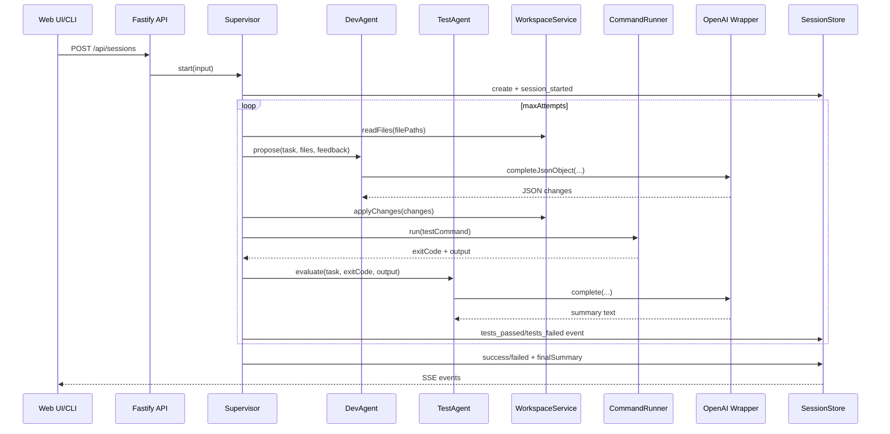

# Step1 내부 구조 튜토리얼: 2-에이전트 오케스트레이션을 코드로 끝까지 이해하기

이 문서는 `step1` 코드를 처음 보는 사람이 문서만 읽고도 다음을 이해하도록 작성했습니다.

- 어떤 컴포넌트가 어떤 책임을 가지는지
- 세션이 어떤 순서로 흘러가는지
- Web UI/CLI/API를 어떻게 테스트하는지
- 어디를 고치면 어떤 동작이 바뀌는지
- 실제 운영 중 자주 나는 오류를 어떻게 잡는지

## 1. 실제 플로우(요청부터 완료까지)

이 프로젝트를 이해하는 가장 빠른 방법은 먼저 실행 흐름을 보는 것입니다.



핵심 요약:

- 요청은 `POST /api/sessions`에서 시작
- Supervisor가 Dev -> Test를 순차 실행
- 실패하면 feedback을 들고 다음 attempt로 재시도
- 상태/이벤트는 SessionStore에 기록되고 UI는 SSE로 실시간 수신

## 2. Step1 한 줄 요약

`step1`은 **Supervisor가 DevAgent와 TestAgent를 순차적으로 지휘하는 로컬 오케스트레이션 실험 환경**입니다.

- DevAgent: 코드 변경안(JSON) 생성
- TestAgent: 테스트 출력 요약/원인 분석
- Supervisor: 재시도 루프, 이벤트 기록, 상태 전환

병렬 멀티 에이전트가 아니라, 의도적으로 **Dev -> Test 순차 루프**로 구현되어 있습니다.

## 3. 빠른 실행 가이드

```bash
cd step1
pnpm install
cp .env.example .env
pnpm dev
```

기본 설정은 `step1/src/config.ts` 기준입니다.

```ts
export const config = {
  port: toInt(process.env.PORT, 3000),
  openaiApiKey: process.env.OPENAI_API_KEY ?? "",
  openaiBaseUrl: process.env.OPENAI_BASE_URL ?? "http://localhost:8000/v1",
  model: process.env.OPENAI_MODEL ?? "gpt-4.1-mini",
  workspaceRoot: path.resolve(process.env.WORKSPACE_ROOT ?? defaultWorkspaceRoot),
  maxCommandOutputChars: toInt(process.env.MAX_COMMAND_OUTPUT_CHARS, 12000)
};
```

핵심 환경변수:

- `OPENAI_API_KEY`: 필수(로컬 wrapper면 임의 문자열도 가능)
- `OPENAI_BASE_URL`: 기본 `http://localhost:8000/v1`
- `OPENAI_MODEL`: wrapper 지원 모델로 맞춰야 함
- `PORT`: 대시보드/서버 포트

## 4. 프로젝트 구조

```text
sample1/
  docs/
    step1.md
  step1/
    src/
      server.ts
      serverApp.ts
      config.ts
      cli.ts
      types.ts
      agents/
        devAgent.ts
        testAgent.ts
      llm/
        openaiClient.ts
      orchestrator/
        supervisor.ts
      services/
        workspace.ts
        commandRunner.ts
        sessionStore.ts
      utils/
        json.ts
      study/
        step1-dev-agent.ts
        step2-dev-test-agent.ts
        step3-supervisor-loop.ts
        step4-supervisor-with-services.ts
    public/
      index.html
      app.js
      styles.css
    tests/
      json.test.ts
      serverApp.test.ts
```

## 5. 핵심 데이터 모델

`step1/src/types.ts`를 보면 세션 모델이 명확합니다.

```ts
export type AgentRole = "supervisor" | "dev" | "test";
export type SessionStatus = "pending" | "running" | "success" | "failed";

export interface SessionInput {
  task: string;
  filePaths: string[];
  testCommand: string;
  maxAttempts: number;
}

export interface SessionState {
  id: string;
  status: SessionStatus;
  input: SessionInput;
  attempt: number;
  startedAt: string;
  endedAt?: string;
  finalSummary?: string;
}
```

의미:

- `filePaths`: 에이전트가 읽고/쓸 파일 범위
- `testCommand`: 각 시도마다 실행할 검증 명령
- `maxAttempts`: 실패 시 재시도 횟수

## 6. 서버 조립(Composition Root)

`step1/src/server.ts`는 의존성을 조립하는 진입점입니다.

```ts
const store = new SessionStore();
const workspace = new WorkspaceService();
const llm = new OpenAiClient();
const commandRunner = new CommandRunner();
const supervisor = new Supervisor(store, workspace, new DevAgent(llm), new TestAgent(llm), commandRunner);

const app = buildApp({
  store,
  supervisor,
  llm,
  commandRunner
});
```

포인트:

- 모든 핵심 모듈이 여기서 연결됨
- `buildApp`으로 HTTP API와 연결됨

## 7. API 레이어 (`serverApp.ts`)

주요 라우트:

- `GET /api/health`: 앱 생존 확인
- `GET /api/tools/overview`: 실행 설정 요약
- `POST /api/tools/llm/ping`: LLM 연결 검증
- `POST /api/tools/command`: 제한된 명령 실행
- `POST /api/sessions`: 오케스트레이션 세션 시작
- `GET /api/sessions`: 최근 세션 목록
- `GET /api/sessions/:id`: 세션 상태 + 이벤트 이력
- `GET /api/sessions/:id/events`: SSE 실시간 이벤트 스트림

명령 실행 제한 로직:

```ts
const hasUnsafeShellChars = (command: string): boolean => /[;&|><`$]/.test(command);

const isCommandAllowed = (command: string): boolean => {
  const normalized = command.trim();
  return /^(pnpm|npm)\s+/i.test(normalized) && !hasUnsafeShellChars(normalized);
};
```

의미:

- `pnpm`/`npm` 계열만 허용
- 셸 연산자 주입을 차단

## 8. LLM 클라이언트 전략 (`openaiClient.ts`)

`OpenAiClient`는 chat endpoint 우선, 필요 시 fallback을 사용합니다.

```ts
async complete(system: string, user: string): Promise<string> {
  try {
    return await this.completeWithChat(system, user);
  } catch (error: unknown) {
    if (!OpenAiClient.isNotFoundError(error)) {
      throw error;
    }
  }

  return this.completeWithResponses(system, user);
}
```

DevAgent 전용 JSON 모드:

```ts
async completeJsonObject(system: string, user: string): Promise<string> {
  try {
    return await this.completeWithChatOptions(system, user, {
      response_format: { type: "json_object" }
    });
  } catch (error: unknown) {
    if (!OpenAiClient.isNotFoundError(error)) {
      throw error;
    }
  }

  return this.completeWithResponses(system, user);
}
```

의미:

- wrapper가 `chat/completions`를 제공하면 그대로 사용
- 404면 `responses` endpoint로 전환
- DevAgent는 JSON 파싱 안정성을 위해 JSON mode를 우선 사용

## 9. Agent 역할 분리

### 8.1 DevAgent

`step1/src/agents/devAgent.ts`

```ts
const system = [
  "You are the dev agent in a supervised coding loop.",
  "Return only JSON object with keys: rationale, changes.",
  "changes must be an array of { path, content } with full file content.",
  "Do not return markdown."
].join(" ");

const raw = await this.llm.completeJsonObject(system, user);
const parsed = JSON.parse(extractJsonObject(raw));
return devSchema.parse(parsed);
```

포인트:

- 결과 형식을 JSON으로 강제
- `extractJsonObject`로 fenced/bare JSON 모두 흡수
- `zod` 스키마로 최종 검증

### 8.2 TestAgent

`step1/src/agents/testAgent.ts`

```ts
const system = [
  "You are the test agent.",
  "Summarize test/build output for a developer in 3-6 lines.",
  "State likely root cause and the next concrete fix.",
  "Plain text only."
].join(" ");
```

포인트:

- 테스트 통과/실패 판단은 exit code가 담당
- TestAgent는 실패 원인과 다음 수정 방향을 요약

## 10. Supervisor 루프(핵심)

`step1/src/orchestrator/supervisor.ts`가 실제 오케스트레이션 엔진입니다.

세션 시작:

```ts
async start(input: SessionInput): Promise<string> {
  const session = this.store.create(input);
  this.run(session.id).catch((error: unknown) => {
    const message = error instanceof Error ? error.message : String(error);
    this.store.pushEvent(session.id, "supervisor", "error", message);
    this.store.updateStatus(session.id, "failed", message);
  });
  return session.id;
}
```

시도 루프의 핵심:

```ts
for (let attempt = 1; attempt <= session.input.maxAttempts; attempt += 1) {
  const files = await this.workspace.readFiles(session.input.filePaths);

  const devOutput = await this.devAgent.propose({
    task: session.input.task,
    files,
    feedback
  });

  await this.workspace.applyChanges(devOutput.changes);

  const commandResult = await this.commandRunner.run(session.input.testCommand);
  const evaluation = await this.testAgent.evaluate({
    task: session.input.task,
    exitCode: commandResult.exitCode,
    commandOutput: commandResult.output
  });

  if (commandResult.exitCode === 0) {
    // success
    return;
  }

  feedback = [
    `Attempt ${attempt} failed.`,
    `Exit code: ${evaluation.exitCode}`,
    `Summary:\n${evaluation.summary}`,
    `Output:\n${evaluation.commandOutput}`
  ].join("\n\n");
}
```

정리:

- 현재 구조는 2-agent 순차 루프
- 실패 피드백이 다음 DevAgent 입력으로 직접 들어감
- 성공 시 즉시 종료, 실패 누적 시 `failed`로 종료

## 11. 서비스 계층

### 10.1 WorkspaceService: 경로 안전 + 파일 반영

`step1/src/services/workspace.ts`

```ts
resolveSafePath(relativePath: string): string {
  const cleaned = relativePath.replace(/^\/+/, "");
  const absolute = path.resolve(this.root, cleaned);
  if (!isInside(absolute, this.root)) {
    throw new Error(`Unsafe path rejected: ${relativePath}`);
  }
  return absolute;
}
```

```ts
async applyChanges(changes: FileChange[]): Promise<void> {
  for (const change of changes) {
    const absolute = this.resolveSafePath(change.path);
    await fs.mkdir(path.dirname(absolute), { recursive: true });
    await fs.writeFile(absolute, change.content, "utf8");
  }
}
```

### 10.2 CommandRunner: 검증 명령 실행

`step1/src/services/commandRunner.ts`

```ts
const child = spawn(command, {
  cwd: config.workspaceRoot,
  shell: true,
  env: process.env
});
```

```ts
const output = combined.slice(-config.maxCommandOutputChars);
resolve({ exitCode: code ?? 1, output });
```

포인트:

- 출력은 tail만 저장하여 로그 폭주를 제한
- supervisor가 이 결과를 TestAgent에 전달

### 10.3 SessionStore: 상태/이벤트 저장 + 구독

`step1/src/services/sessionStore.ts`

```ts
private readonly sessions = new Map<string, SessionState>();
private readonly events = new Map<string, SessionEvent[]>();
private readonly emitter = new EventEmitter();
```

```ts
subscribe(sessionId: string, handler: (event: SessionEvent) => void): () => void {
  const channel = `session:${sessionId}`;
  this.emitter.on(channel, handler);
  return () => this.emitter.off(channel, handler);
}
```

포인트:

- 현재는 in-memory 저장소
- 서버 재시작 시 세션 이력은 사라짐
- SSE는 `subscribe`를 통해 실시간 push

## 12. JSON 파서 안정화 포인트 (`utils/json.ts`)

`extractJsonObject`는 모델 출력이 깔끔하지 않을 때를 대비한 방어 로직입니다.

```ts
export const extractJsonObject = (text: string): string => {
  const fencedJsonPattern = /```json\s*([\s\S]*?)```/gi;
  let match: RegExpExecArray | null;

  while ((match = fencedJsonPattern.exec(text)) !== null) {
    const fencedBody = match[1].trim();
    if (canParseJsonObject(fencedBody)) return fencedBody;
    const nested = findFirstJsonObjectSlice(fencedBody);
    if (nested) return nested;
  }

  const bare = findFirstJsonObjectSlice(text);
  if (bare) return bare;

  throw new Error("No JSON object found in model output.");
};
```

핵심:

- fenced json 블록 우선 파싱
- 실패 시 본문 전체에서 brace 스캔
- 문자열 이스케이프를 고려해 첫 유효 object를 선택

## 13. Web UI 동작 방식 (`public/app.js`)

대시보드 동작의 핵심은 3가지입니다.

1. 진단 도구
2. 세션 시작
3. SSE 모니터링

SSE 연결 코드:

```js
stream = new EventSource(`/api/sessions/${sessionId}/events`);
stream.onmessage = async (msg) => {
  const eventData = JSON.parse(msg.data);
  appendEvent(eventData);
  await loadStatus(sessionId);
  await loadSessions();
};
```

세션 생성 코드:

```js
const payload = {
  task: document.getElementById("task").value,
  filePaths: document
    .getElementById("files")
    .value.split(",")
    .map((x) => x.trim())
    .filter(Boolean),
  testCommand: document.getElementById("test").value,
  maxAttempts: Number.parseInt(document.getElementById("maxAttempts").value || "3", 10)
};

await fetchJson("/api/sessions", {
  method: "POST",
  headers: { "Content-Type": "application/json" },
  body: JSON.stringify(payload)
});
```

## 14. 세션 입력값을 어떻게 줘야 하나

예시:

```text
Task:
extractJsonObject가 fenced json과 bare json을 모두 안정적으로 파싱하도록 개선

File paths:
src/utils/json.ts,tests/json.test.ts

Test command:
pnpm test

Max attempts:
3
```

입력 규칙:

- `Task`: 변경 목적을 구체적으로 작성
- `File paths`: 수정 대상 소스 + 관련 테스트를 같이 포함
- `Test command`: 빠르고 재현 가능한 명령 사용
- `Max attempts`: 보통 2~4

## 15. 두 번째 세션은 무엇을 하는가

첫 번째가 LLM Ping이라면 그것은 단순 연결 체크입니다.

실제 오케스트레이션은 **Session Runner에서 Start Session을 누른 다음 생성된 세션**이 수행합니다.

- DevAgent가 `filePaths` 기준으로 파일을 읽고 변경안 생성
- 변경 반영 후 `testCommand` 실행
- 실패 시 TestAgent 요약을 feedback으로 넣고 다음 attempt 수행

즉, 두 번째 세션은 “실제 코드 수정 + 테스트 자동 루프”를 담당합니다.

## 16. 테스트 명령 모음

### 16.1 전체 테스트

```bash
cd step1
pnpm test
```

### 16.2 서버 실행 중 API 확인

```bash
curl -s http://localhost:3001/api/health | jq
curl -s http://localhost:3001/api/tools/overview | jq
curl -s -X POST http://localhost:3001/api/tools/llm/ping \
  -H 'content-type: application/json' \
  -d '{"prompt":"Respond with one short line: ping accepted"}' | jq
```

### 16.3 CLI 오케스트레이션 실행

```bash
cd step1
pnpm cli -- \
  --task "extractJsonObject 안정화" \
  --files "src/utils/json.ts,tests/json.test.ts" \
  --test "pnpm test" \
  --max-attempts 3
```

## 17. 자주 나는 오류와 해결

### 17.1 `OPENAI_API_KEY is required`

원인:

- `step1/src/config.ts`의 `assertConfig()`에서 필수값 검증 실패

해결:

```bash
cd step1
cp .env.example .env
# .env에 OPENAI_API_KEY 설정
pnpm dev
```

### 17.2 `EADDRINUSE: 0.0.0.0:3000`

원인:

- 같은 포트를 이미 다른 프로세스가 사용 중

해결:

```bash
lsof -i :3000
# 기존 프로세스 종료 또는 .env에서 PORT 변경
```

### 17.3 `LLM Ping Error "Not Found"`

원인 후보:

- wrapper가 `chat/completions` 또는 `responses` 중 하나만 제공
- `OPENAI_BASE_URL` 경로가 wrapper와 불일치
- 서버가 구버전 코드로 떠 있음

체크 순서:

1. `GET /api/tools/overview`에서 `openaiBaseUrl` 확인
2. wrapper 로그에서 실제 호출 경로 확인
3. `step1` 서버 재시작 후 재검증

### 17.4 세션이 `running`에서 오래 멈춤

원인 후보:

- wrapper 응답 지연/타임아웃
- `testCommand`가 종료되지 않음(watch 모드 등)

해결:

- `testCommand`는 반드시 종료형 명령(`pnpm test`) 사용
- wrapper 타임아웃/모델 설정 점검

## 18. 학습용 단계 코드(`src/study/*`) 활용법

```bash
cd step1
pnpm study:1
pnpm study:2
pnpm study:3
pnpm study:4
```

추천 순서:

1. `study:1`: DevAgent 단독 이해
2. `study:2`: Dev/Test 협업 이해
3. `study:3`: attempt 루프 이해
4. `study:4`: 파일 적용 + 명령 실행 결합 이해

## 19. 확장 포인트

현 구조에서 자연스럽게 확장할 수 있는 지점:

1. `SessionStore`를 DB로 교체해 이력 영속화
2. `Supervisor`에 단계별 타임아웃/취소 토큰 추가
3. DevAgent 출력을 full-file 대신 diff 패치로 전환
4. TestAgent 요약을 카테고리화(컴파일/테스트/런타임)
5. filePaths 자동 추천(리포지토리 검색 기반) 기능 추가

## 20. 체크리스트 (운영 전 최종 확인)

- `pnpm test` 통과
- `pnpm build` 통과
- `GET /api/health` 정상
- `POST /api/tools/llm/ping` 정상
- 세션 1회 실행 시 `dev changes_applied` + `test tests_*` 이벤트 확인

## 21. 한 문장 결론

`step1`은 “Dev가 고치고 Test가 해석하며 Supervisor가 재시도하는” 오케스트레이션을 가장 단순하고 명확하게 보여주는 실전형 베이스라인입니다.
